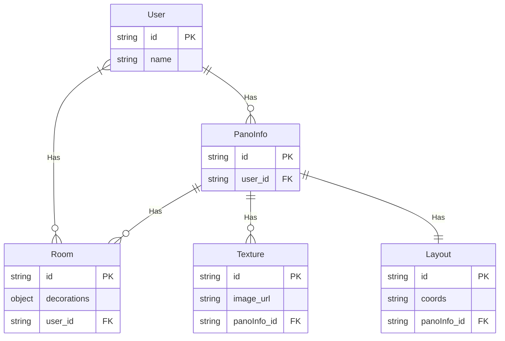

# pano-to-mesh-server
On-premise of pano-to-mesh

# DB Schema 

```mermaid
erDiagram
    User {
        string id PK
        string name
    }
    Room {
        string id PK
        object decorations
        string user_id FK
    }
    PanoInfo{
        string id PK
        string user_id FK
    }
    Texture {
        string id PK
        string image_url
        string panoInfo_id FK
    }
    Layout {
        string id PK
        string coords
        string panoInfo_id FK
    }

    User }|--o{ Room: "Has"
    PanoInfo ||--o{ Room : "Has"
    PanoInfo ||--o{ Texture: "Has"
    PanoInfo ||--|| Layout: "Has"
    User ||--o{ PanoInfo: "Has"
```
